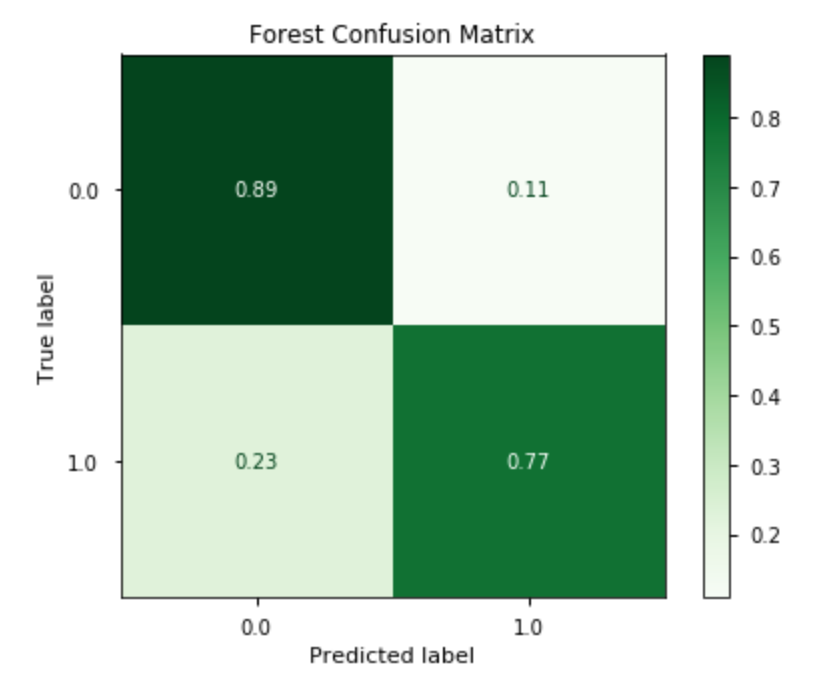
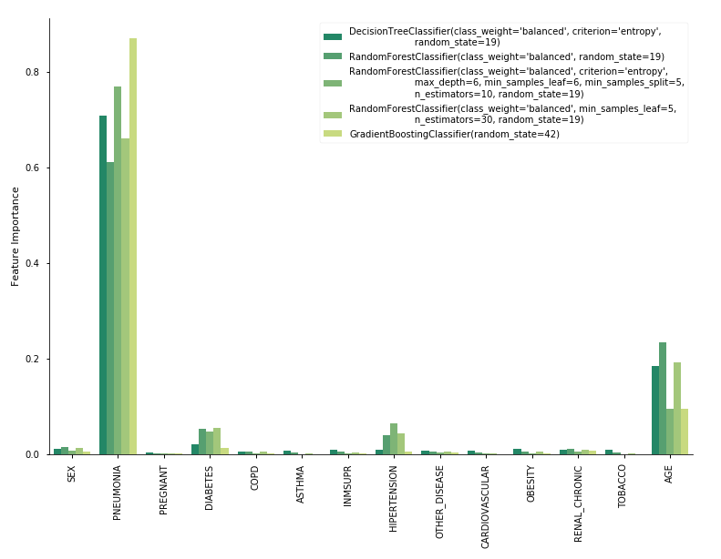
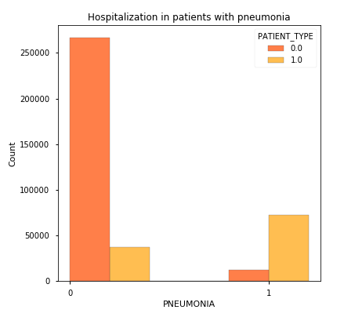
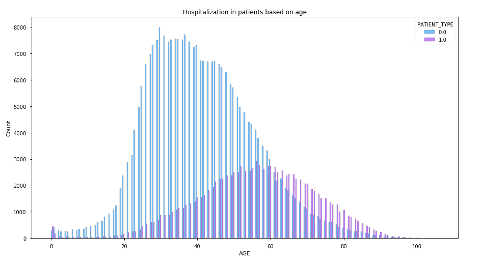
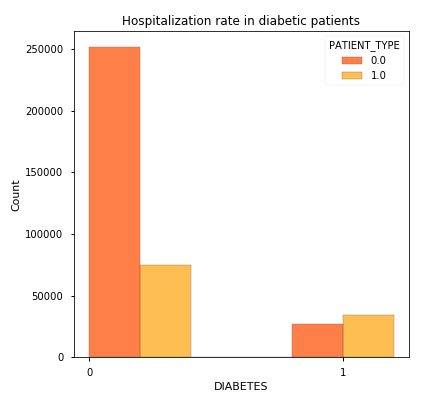
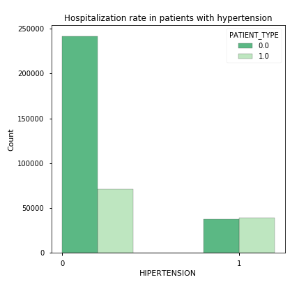
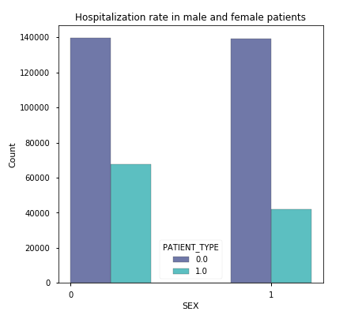

# Phase 3 project

**Author**: Maria Kuzmin

### Introduction
During the Covid-19 pandemic, one of the major issues in the healthcare system was the shortage of medical resources and the lack of a system to distribute them according to the local hospitals and facilities’ needs.

In this project we analyzed a dataset with information about patients' health conditions and tried to predict whether the patient is at risk for needing to be hospitalized due to Covid-19 infection. We focused only on the patients that tested positive for Covid-19. As the target, we studied whether or not the patient was admitted into the hospital or sent home to continue treatment independently.

Being able to predict such information could help to estimate the amount of people that will require hospitalization for the next pandemic.
This would assist authorities in procuring and arranging for the resources necessary to treat all the patients in need. Based on this model we were also able to look at the most crucial conditions that ultimately put a patient at risk of hospitalization and to help the healthcare system target those factors specifically.

### The Stakeholders: the CDC
Analyzing the medical conditions of patients in a certain area or county could help the CDC and hospitals predict the amount of patients they should expect to hospitalize, and therefore being prepared and properly equipped to treat them.
Looking at the most determining factors for high-risk in patients, the CDC could also direct specific effort to treat and prevent such conditions, launching health campaigns and alerting healthcare providers about those conditions.

### The Goal:
The main goal of this project is to build a machine learning model that, given a Covid-19 patient's current health condition and medical conditions, will predict whether the patient is at high-risk or not for needing to be hospitalized. Investigating more in depth the best performing models, we will also analyze what are the factors that are most influetial in determining whether a patient is at risk or not.
We do not know when the next pandemic will hit, and what will be the main risk factors for patients and what will be the supplies most needed from hospitals.
With this model, simply by using some data from the first infected patients, we can quickly draw conclusions about the most relevant risk factors.
This would allow the CDC and the health care system to analyze the first available data of the patients hospitalized during the first few months of the next pandemic (that would have been January and Februray 2020 for the last pandemic) to find out right away what are the main risk factors of the disease.
This would give hospitals precious time to prepare in terms of supplies and personnel. Also, using the model on the demographics of the patients living near a hospital, it would be possible to find out how many patients to expect to intake due to a new disease.

Roadmap:
* Dataset
* Data Preparation:
        Selection of Target
        Data Cleaning
        Train Test Split
        Scaling
* Models:
* Logistic Regression Model
* Decision Tree Classifier
        Including Class Imbalance
* Random Forest Classifier
        Including Class Imbalance
* Model Tuning:
* First GridSearchCV
* Second GridSearchCV
* Third GridSearchCV
* Fourth GridSearchCV
* Gradient Boosting
* Results:
* Best Models Performance
* Features Importance
* Conclusion
* Recommendations
* Next Steps

## The Data:
### The Covid-19 Dataset
Description of Dataset
The dataset was provided by the Mexican government.
It contains an enormous number of anonymized patient-related information including pre-conditions.
The raw dataset consists of 21 unique features and 1,048,576 unique patients.
In the Boolean features, 1 means "yes" and 2 means "no". values as 97 and 99 are missing data.
| column name    | content         | 
|----------------|-----------------|
sex : 1 for female and 2 for male.
age : of the patient.
classification: covid test findings. Values 1-3 mean that the patient was diagnosed with covid in different degrees. 4 or higher means that the patient is not a carrier of covid or that the test is inconclusive.
patient type: type of care the patient received in the unit. 1 for returned home and 2 for hospitalization.
pneumonia: whether the patient already have air sacs inflammation or not.
pregnancy: whether the patient is pregnant or not.
diabetes: whether the patient has diabetes or not.
copd: Indicates whether the patient has Chronic obstructive pulmonary disease or not.
asthma: whether the patient has asthma or not.
inmsupr: whether the patient is immunosuppressed or not.
hypertension: whether the patient has hypertension or not.
cardiovascular: whether the patient has heart or blood vessels related disease.
renal chronic: whether the patient has chronic renal disease or not.
other disease: whether the patient has other disease or not.
obesity: whether the patient is obese or not.
tobacco: whether the patient is a tobacco user.
usmr: Indicates whether the patient treated medical units of the first, second or third level.
medical unit: type of institution of the National Health System that provided the care.
intubed: whether the patient was connected to the ventilator.
icu: Indicates whether the patient had been admitted to an Intensive Care Unit.
date died: If the patient died indicate the date of death, and 9999-99-99 otherwise.

### Data Preparation:
First we selected only patients that tested positive for Covid-19.
Consequently we explored all the columns with informations about how the patients were treated and selected our target 'Patient Type' which describes whether a patient was hospitalized or sent back home.
The Data cleaning included: handling missing values, removing outliers, splitting into Train and Test set and scaling the numerical values.

### Metrics:

Overall we would prefer to have as little false negatives as possible, because that indicates how many patients we predicted would **not** need to be hospitalized when they actually did.
<br>That would lead to unpreparedness from the hospital and we would rather not have that, even if it means on the contrary the possibility of having an extra resource that is not needed (which is if we have a false positive).
<br>Because of this we are going to look for the model with the highest **Recall**.
<br>We want our model to be good overall, and to make sure we don't lean only toward a high recall.
<br>Because of this together with Recall we are going to keep an eye on the **F1 score**, which gives us a sense of how the model is performing overall and would penalize it if the precision plummeted.
<br>We will also be comparing the model's roc_auc_score as another parameter to evaluate the general goodness of the model.
<br>All this said, let us take a look at the results of our first model.

## Models:
We used different models and evaluted them based on their Recall, F1 score, AUC score and ROC curve.
The models used were:
Logistic Regression
DecisionTree Classifier
Random Forest

The model that performed best was the Random Forest and we decided to try to improve it by using GridSearchCV to find the best parameters for it.
After four Grid Searches we obtained our best performing Random Forest that produced the following confusion Matrix:
<br>


To try to obtain even better results we used GradientBoost as our last model.

The results of these two final model compared are:

Random Forest:
    Recall 0.774771
    F1 0.755985 
    AUC 0.898740
GradientBoost:
    Recall 0.679773
    F1 0.754334
    AUC 0.900313

GradientBoost performed better than the Forest in terms of the F1 score and the AUC score (but only very slightly) but the Recall was 10% less.
This is why we decided to keep the Random Forest as our best model since the performance is only very slightly inferior, but the recall is remarkably higher.


## Features Importance
One more very important step in our study is to understand what are the main variables that determined the outcome in our models, or simply put what are the most relevant factors that determine if a person is at high risk or not to be hospitalized.
To do this we can extract this information directly from our models and then we are going to study the top 5 important features.
<br>

The five most important features in our selection overall for the models are:
- Pneumonia
- Age
- Diabetes
- Hypertension 
- Sex

Let us take a closer look at each one of these.
### Pneumonia
Out of the patients that had pneumonia, 86% of them needed hospitalization, while for patients without pneumonia the chance of hospitalization was 12%.
<br>

### Age
We can observe two different trends with age. 
In general an older age brings a higher chance to be hospitalized, since the hospitalization rate for people between 20 and 30 years old was only 8%, while it was almost 60% for people between 60 and 70, and it reached almost 70% for people between 70 and 80.
 For younger kids instead we see that with age increasing the chance of hospitalization decreases, as it goes from   61% for kids younger than 1, to 30% for kids between 1 and 2 and to 18% for kids between 2 and 3. 
 <br>
 
### Diabetes
Out of the patients that had diabetes: 56% of them needed hospitalization, while for patients without diabetes the    chance of hospitalization was only 23%.
<br>

### Hypertension
Looking at hypertension: in the patients suffering hypertension 51% of them needed to be hospitalized, while for the patients with regular blood pressure, the chance of hospitalization was 23%.
<br>


### Sex
Hospitalization based on sex: while only 23% of women needed to be hospitalization, the rate for males was 33%.
<br>


## Recommendations

Based on our model we found that the most relevant factors that determine a patient's risk to be hospitalized are 
age and sex together with suffering from pneumonia, diabetes and hypertension.
<br>We would recommend for the CDC to launch health campaings to start to treat and prevent pneumonia, hypertension and diabetes.
<br>Older people and infants under one year old, together with men turned out to be the groups more at risk. <br>Informing the population of this can help people belonging to these groups stay particularly safe by taking extra precautions.
<br>The CDC should inform healthcare providers of these risk factors so that they could start to specifically treat these conditions and closely follow their high-risk patients.

We do not know when the next pandemic will hit and how many people will need to be hospitalized and what will be the most important factors that determine a patient to be at risk.
<br>Starting from this model the CDC and local hospitals could become more prepared for the next pandemic.
<br>By simply using some samples of people that got sick with a new virus, and by fitting and running this model we could find out in a timely manner what are the factors that are most important to pay close attention to.
<br>With this model, we could have used the months of January and February back in 2020 to study the first Covid-19 patients and understand what factors to look for and how many people we could expect to need hospitalization.
<br>By applying the same model (fitted for the new disease) to the population of a certain area, we could predict how many people would need to be hospitalized, so a hospital could be prepared in terms of equipment and personnel to be able to treat all the patients in need.

# Conclusions:
Based on our model we could predict the amount of patients that needed to be hospitalized, reaching an F1 score of 76%, a roc auc score of 90% and with a recall of 77%.
In our specific study, the model identified correctly 83,468 patients and incorrectly 13,751 with an overall accuracy of 86%. <br>The results reported refer to the test set but the values are almost exactly the same also for the train set.
<br>
<br>Looking at the best models, the features that turned out to be most important in determining the risk factor for patients were pneumonia, age, diabetes, hypertension, and sex.
<br> The most relevant results:
<br> Patients with pneumonia turned out to be 7 times more likely to need hospitalization.
<br> Older people had a higher chance of needing hospitalizations, especially from their 60s on, with the exception of infants under one year old that were also at higher risk for hospitalization.
<br>We had learned this from experience, and could gather this information as the pandemic kept progressing and risk factors became clear.
<br>But the problem is...

## Next Steps

To further improve our model we could try to work on a broader sample of patients in order to see if other trends would emerge in terms of risk factors.

We could also study more in depth the effect of multiple factors' interaction at play in high-risk patients.

We could refine the model by population or area, fitting it on different samples of different populations, as different groups of people might suffer from diseases or risk factors based on the climate, local health habits, genetic components as well as socio-economic status.

With more powerful AI tools we could automate the process of extracting the most important factors and studying them. This would result in the model being more efficiently applied to a new disease and study the risk factors while here that selection had to be done by hand.

## For More Information

Please review my full analysis in [my Jupyter Notebook](./CovidNotebook.ipynb) or my [presentation](./Presentation.pdf).

For any additional questions, please contact **Maria Kuzmin, marianlkuzmin@gmail.com**

## Repository Structure

Description of the structure of the repository and its contents:

```
├── Covid Data.csv
├── Graphs
    └── Age.png
    └── ConfusionMatrix.png
    └── diabetes.png
    └── Features.png
    └── hyper.png
    └── pneum.png
    └── ROC.png
    └── Sex.png
 ├── CovidNotebook.ipynb   
 ├── Presentation.pdf
 └── README.md